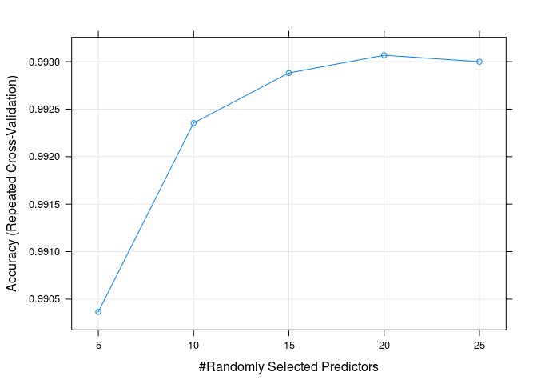

# Practical Machine Learning Assignment
Author: UltraMagnus  
# Overview  

We are using Human Activity Recognition data obtained from  [link](http://groupware.les.inf.puc-rio.br/har). There are five kind of activities ('A', 'B', 'C', 'D', 'E') and the mesurements are taken from wearable devices attached to body. we will be using the randomforest to predict which activity was performed from the mesurements at specific time.  

# Loading the Data  

Reading the Data from csv files 'Tdata' contain the traning data and Sdata contains the 20 test case to be submitted.  


```r
dirpath="/home/lotus/Data_Science/08_Practical Machine Learning/GIT/"
#cells having values "NA" and "" are treated as NA
NAstrings = c("NA", "")
Tdata<-read.table(paste0(dirpath,"pml-training.csv"), header = TRUE,
                  na.strings = NAstrings, sep = ",")
SubmissionData<-read.table(paste0(dirpath,"pml-testing.csv"), header = TRUE, 
                  na.strings = NAstrings, sep = ",")
```

# Cleaning the Data  

1. Calculating the index of columns which contains the NA values, rmCol contains the 
index of those columns.

```r
library(dplyr)
i<-0
rmCol<-NULL
for(i in 1:ncol(SubmissionData))
{
  if(sum(is.na(SubmissionData[, i]))  > 0)
		rmCol<-c(rmCol,i)
}
```

Removing columns containing NA values


```r
Tdata<-select(Tdata, -rmCol)
SubmissionData<-select(SubmissionData, -rmCol)
```

Removing unuseful colums  

```r
Tdata<-select(Tdata, -c(X,user_name, cvtd_timestamp, new_window, num_window))
SubmissionData<-select(SubmissionData, -c(X,user_name, cvtd_timestamp,
                                          new_window, num_window))
dim(Tdata)
```

```
## [1] 19622    55
```

```r
dim(SubmissionData)
```

```
## [1] 20 55
```

so finally both contains 55 columns  

# Creating Traning and Test Set
creating the Traning and Test set 70% for Training and 30% for Testing. 

```r
library(caret)
set.seed(12321)
testIndex = createDataPartition(Tdata$classe, p = 0.70,list=FALSE)
training = Tdata[-testIndex,]
testing = Tdata[testIndex,]
```

# Training  and Crossvalidation

## Setting the parameters

1. setting the 'mtry' parameter (the number of variables randomly-selected to go in each tree).  
first with mtry=5 and again with mtry= 15

```r
customGrid <- data.frame(mtry=c(5, 10, 15, 20, 25))
```

2. setting method = "repeatedcv",  number = 10 and repeats = 10.  

```r
fitControl <- trainControl(method = "repeatedcv",number = 10,repeats = 10)
```


3. number of trees grown in each forest 'ntree' is set to 200 because default value is 500 which take too much time.  

## Training using training data by randomForest.  
It use 10 separate 10-fold cross-validations are used as the resampling scheme on training dataset, caret train function use repeated cross validation to tune the parameter to generate optimal model fit.


```r
modFit <- train(classe ~ ., data=training, method="rf",
  trControl=fitControl, tuneGrid=customGrid, ntree=200)
```


```r
modFit$bestTune 
```

```
##   mtry
## 4   20
```

```r
plot(modFit)
```

 

After tuning the parameters using crossvalidation, the best accuracy obtained at mtry = 20.  

## Accuracy on Training set  using crossvalidation


```r
modFit$results$Accuracy
```

```
## [1] 0.9903655 0.9923539 0.9928807 0.9930673 0.9929996
```

The best accuracy obtained using cross validation is 99.31% obtained at mtry = 20.

#Testing
Testing the generated model on left over test data which is not used in training and       
cross validation.  
55th column is omitted from predictor as it containes 'classe' variable which is to be predicted. 

```r
predictions<-predict(modFit,testing[,-55])
```

```
## Loading required package: randomForest
## randomForest 4.6-10
## Type rfNews() to see new features/changes/bug fixes.
## 
## Attaching package: 'randomForest'
## 
## The following object is masked from 'package:dplyr':
## 
##     combine
```

Creating  the confusion matrix from actual class and predicted classes.

```r
CM<-confusionMatrix(testing$classe, predictions)
CM$table
```

```
##           Reference
## Prediction    A    B    C    D    E
##          A 3901    4    0    1    0
##          B   26 2632    0    0    0
##          C    0   23 2369    4    0
##          D    0    0   32 2217    3
##          E    0    0    3   12 2510
```

```r
CM$overall
```

```
##       Accuracy          Kappa  AccuracyLower  AccuracyUpper   AccuracyNull 
##      0.9921380      0.9900538      0.9905157      0.9935463      0.2858703 
## AccuracyPValue  McnemarPValue 
##      0.0000000            NaN
```

### Out of sample error
Since this testing data is not used in training or model building (cross validaton). The error estimate on it will be proper estimate of out of sample error.   
we can see accurary is 99.21% which is quite statisfactory.  

### On data used for submission  

using randomforest class labels are  


```r
res<-predict(modFit,SubmissionData[,-55])
res
```

```
##  [1] B A B A A E D B A A B C B A E E A B B B
## Levels: A B C D E
```

Result: All test cases passed.  
